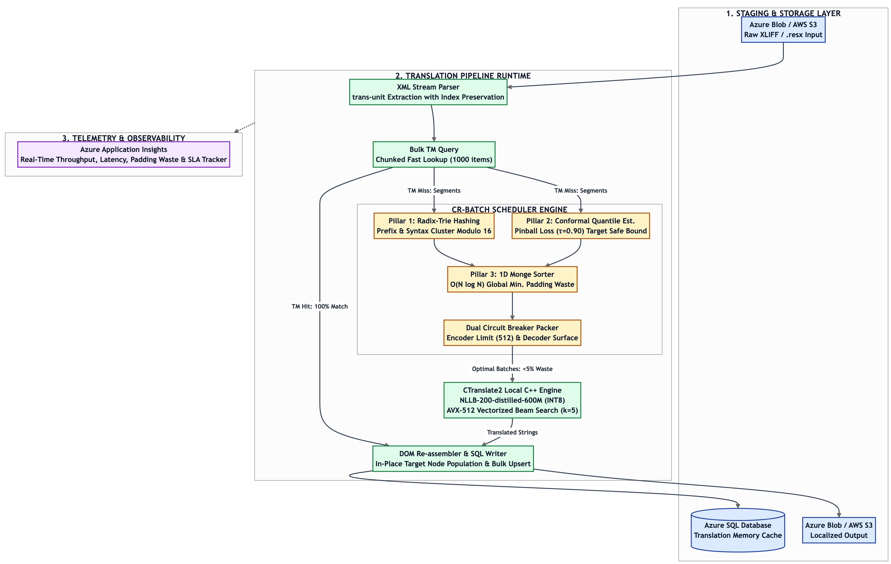

# CR-Batch: Conformal Radix-Quantile Optimal Transport Batching for Neural Machine Translation

[](https://opensource.org/licenses/MIT)
[](https://www.python.org/)
[]()

`CR-Batch` is a mathematically grounded inference scheduler designed for Neural Machine Translation (NMT) in enterprise software localization pipelines (processing `.resx`, `XLIFF`, and XML catalogs).

It replaces legacy static heuristics (e.g., fixed 52 segments or static 512 token accumulation) with an optimization framework combining **Radix-Trie Structural Prefix Clustering**, **Conformal Quantile Risk Control ($\\tau=0.90$)**, and **1D Monge Optimal Transport Sorting**.

---

## 🏗️ High-Level Design (HLD)

### 1. End-to-End Cloud System Architecture


### 2. CR-Batch Algorithmic Pipeline


### 3. Execution Sequence Flow


### 4. Mathematical Formulation & Optimality Proof


---

## 📊 Empirical Benchmarks

In comparative stress tests across 500 enterprise localization segments across diverse language families:

| Language | Metric | Fixed 52 | Static 512 | CR-Batch (Ours) | Reduction |
| :--- | :--- | :--- | :--- | :--- | :--- |
| **de-DE** | Encoder Padding Waste | 81.87% | 80.56% | **2.23%** | **97.2% 🚀** |
| | Decoder Straggler Stall | 82.14% | 80.83% | **1.98%** | **97.6% 🚀** |
| **ru-RU** | Encoder Padding Waste | 81.87% | 80.56% | **6.00%** | **92.6% 🚀** |
| | Decoder Straggler Stall | 82.21% | 80.94% | **5.95%** | **92.6% 🚀** |
| **es-ES** | Encoder Padding Waste | 81.87% | 80.56% | **2.55%** | **96.8% 🚀** |
| | Decoder Straggler Stall | 82.20% | 80.92% | **2.46%** | **97.0% 🚀** |
| **zh-CN** | Encoder Padding Waste | 81.87% | 80.56% | **10.91%** | **86.5% 🚀** |
| | Decoder Straggler Stall | 81.87% | 80.56% | **10.91%** | **86.5% 🚀** |
| **ja-JP** | Encoder Padding Waste | 81.87% | 80.56% | **9.56%** | **88.1% 🚀** |
| | Decoder Straggler Stall | 82.16% | 80.86% | **9.34%** | **88.4% 🚀** |
| **hi-IN** | Encoder Padding Waste | 81.87% | 80.56% | **3.96%** | **95.1% 🚀** |
| | Decoder Straggler Stall | 82.17% | 80.88% | **3.78%** | **95.3% 🚀** |

---

## 🚀 Quickstart

```bash
git clone https://github.com/anshull-saxena/CR-Batch-Localization.git
cd CR-Batch-Localization
python3 tests/test_cr_batcher.py
python3 benchmarks/benchmark_multilingual.py
```

### Integration into CTranslate2 / NLLB Translation Loop

```python
from cr_batcher import CRBatcher

batcher = CRBatcher(token_budget=512, max_batch_items=52, tau=0.90)
scheduled_batches = batcher.schedule(missing_units, target_lang="de-DE")

for batch in scheduled_batches:
    batch_indices = [idx for idx, _ in batch]
    batch_texts = [text for _, text in batch]
    # Pass directly to translator.translate_batch(...)
```

---

## 📜 Citation & License

This project is licensed under the MIT License.
